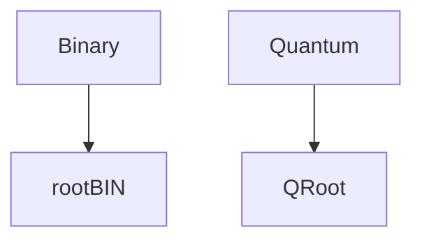

## [QOS](QOS⚛️.md) has a binary and quantum modes. This modes running their own processes and handlers each in different partitions

By default system using Quantum mode, but in case of crash, error, or if user manually switch modes, it can be switched to Binary

### Modes Decription
#### Quantum
Quantum mode is just a main system running place, internal command are executing without any prefixes. Normal system mode.
#### Binary
Binary system's mode is running in [rootBIN](rootBIN.md) partition and has direct access to system's core. If you need to enter binary mode without error or crash, you need to execute `qtk sysmode switch -f q -t bin` command
>[!WARNING] Prefixes
>To run this program it must contain `qtk` command prefix, which allows command to execute on behalf of system's core, if you not in binary mode, you cannot execute command on behalf of core without this prefix
>
>QOS also has `qtc` prefix, this prefix is even deeper accessed than `qtk`
>If you run command under this prefix, it will be executed as[ESFS.Q](ESFS.Q.md)/[ESFS](ESFS.md) internal command
>Utilities like `diskpart, pcctrl, fsctrl` running ***only*** with `qtc` prefix, but system has pre-defined aliases so user can enter just `diskpart` instead of `qtc diskpart`

If user in any mode except Quantum, aliases wouldn't work, so user needs to manually specify prefix in command