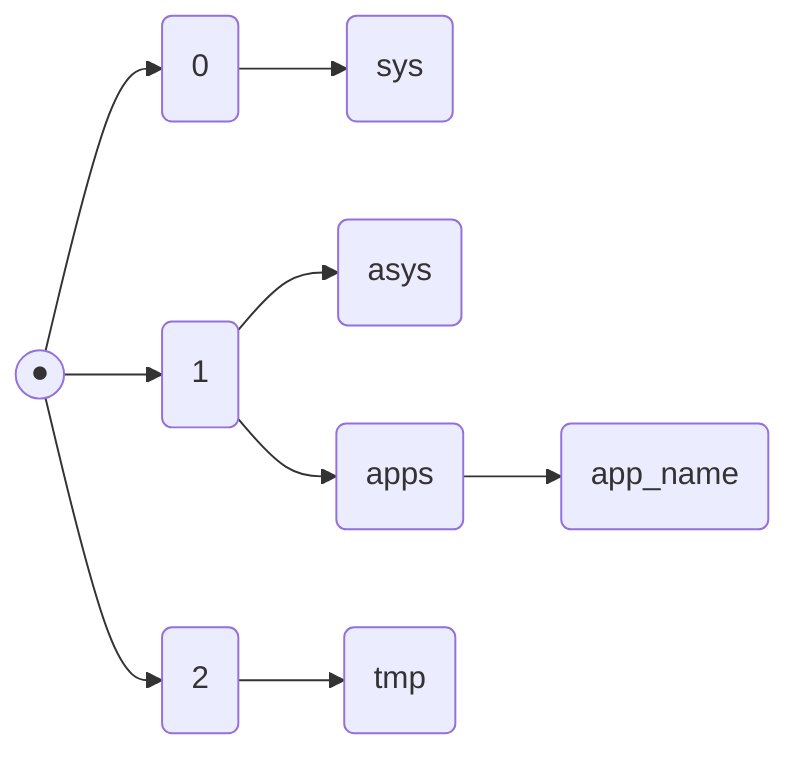

[QOS](QOS⚛️.md) has a specific component named Bit-[registry](Registry.md)

Bit registry storing all the system variables, created by [apps](Apps.md), services, [daemons](Daemons.md) e.t.c.

Bit registry separated for 3 sections

0. System
1. Apps
2. Cache


If your code creates a variable
>[!Example] override.cfg
>```conf
>@var{icon} in /frontend/main.objq ~ /icon.svg
>```

It will be automatically associated with `1` BitReg section stored in `1/apps/app_name/icon(var_name)`

So if your code creates temporary variable like `i` in Python loops, it will be stored in `2` section `2/app_name/i(var_name)`

One of specs of BitReg is that it can store multiple vars with one name at one path

Started from QOS v32 and [QTK](QTK.md)v22 BitReg using [Derivatives](Derivatives.md) system for storing it's values

>[!NOTE]
>in QOS's v38 patch#3250s1 component BitRegHandler was removed and replaced with new function using LocalSignHandler, so developers blocked any possibility to return old BitReg storing system
>>Restoring old BitReg can be done by spoofing the core's VerCTRLD service for an older version which is restoring old BitReg
>>>Now, to return old BitReg you should install custom built core signed with non-DT's digital sign, core which is not affiliated with DT, but its harder to use and get any updates