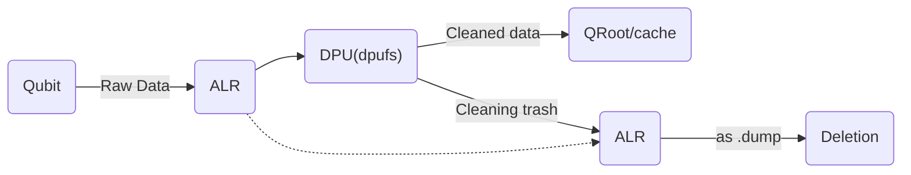

### Why QOS works only on DPU-capable processors, like DT's   X-serial and Y-serial 

The answer is easy! Qbits are fast, very fast, blindingly fast, by the have one drawback, as their quantum nature, qubits are making too my ch error in their calculations, basing on [QTK](QTK.md)'s quantum processing algorithms, error can be eliminated, but it takes so long. It's not that long for texting in console, but too long when you need to render a video, play a game, ore compile program. So there's solution, DPU! DPU gets raw qubit's data, just taken after qubit's calculation completed. DPU is ***binary*** processor with specific instructions that can blindingly fast eliminate all the calculation errors! But there is one drawback, again..., qubit raw data cannot be sent directly to DPU because DPU is binary and quits are quantum and data is incompatible😢

### How can we fix **↑** that issue? The answer is..., [ALR](ALR.md)!
ALR used to determine qubit raw data as logical file, not just "raw data"
So after qubit calcs data sends to ALR and ALR sends it to DPU(dpufs). So this can be described with followed diagram **↓**

After all, cleaned from errors, data will be transmitted from DPU to system on path `QRoot/cache` and all the errors, dumped from qubits, will sent back to ALR **↑**
Extruded from DPU .dump file are extremely heavy, like ~140TB per file! How can it be handled? [Here](ESFS.Q.md) is the answer