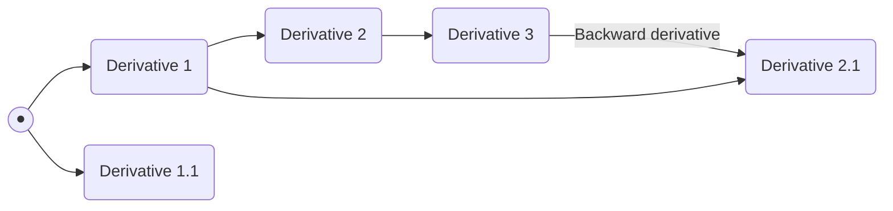
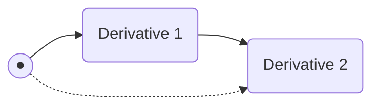
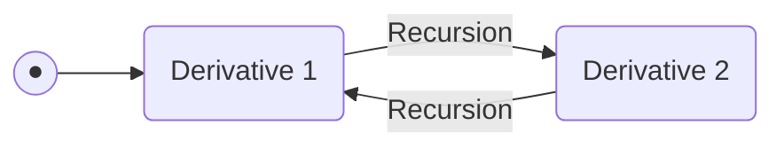

### Snapshots
[QOS](QOS⚛️.md) has an ability of creating [ESFS.Q](ESFS.Q.md) momentum snapshots. Momentum snapshots is a very little metadata file archive which describes to file but only it's changes after previous snapshot. That helps to restore data with blinding speed(but it needs time to restore qubit's states)
In addition to this **↑** these snapshots are extremely small sized, like 2-4 KiB

### Derivatives
Derivatives is an improved version of [Snapshots](#Snapshots) added in [ESFS](ESFS.md) API v6.
They stored hierarchically, like this **↓**



#### Derivatives functions
Derivatives support various functions like inheritance of another derivatives through local links(Derivatives-specific func), transmitted data sharing, soft-link marker connecting, recursive inheritance e.t.c
#### Functions detailed
##### Inheritance of another Derivative(DI)
Derivative inheritance - specified function in ESFS, that implements possibility to create derivative from another derivative
>[!EXAMPLE]
>```mermaid
>graph LR
>
>root((●)) --> dr(Derivative 1) -- Inheritance --> dr2(Derivative 2)
>```

In this **↑** Derivative 2 is inherited from Derivative 1
This is a basic snapshots **and** derivatives function

##### Transmitted data sharing(TDS)
Data, stored in derivative, can be transmitted to another derivative with soft-link, this provides possibility to implicate data from one derivative to absolutely *another* derivative, even if it was created 2 years ago

>[!INFO]
>This method used for storing registry variables since [QOS](QOS⚛️.md) v32 and [QTK](QTK.md) v22

##### Soft-link marker connection
This action just created symbolic link to another derivative


##### Recursive inheritance
Recursive inheritance is just linking to **different** derivative to recursive each other
