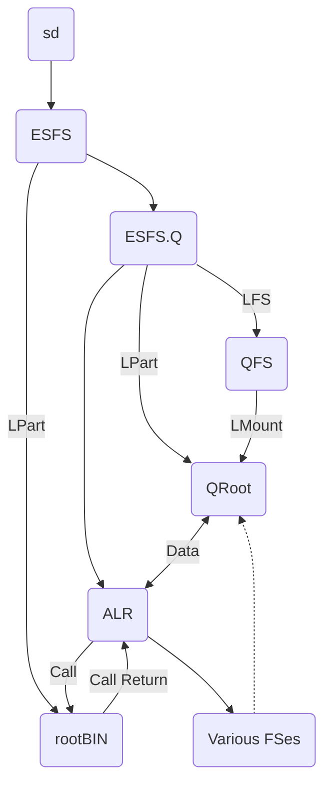

QOS has a specific filesystem hierarchy which is represented with diagram below

```mermaid
graph

sd(sd) --> esfs(ESFS)
esfs --> esfsq(ESFS.Q)
esfsq -- LFS --> qfs(QFS)
esfsq -- LPart --> qroot
esfsq --> alr(ALR)
esfs -- LPart --> rootbin(rootBIN)
qroot <-- Data --> alr
alr -- Call --> rootbin
rootbin -- Call Return --> alr
alr --> vfs(Various FSes)
qfs -- LMount --> qroot(QRoot)
vfs -.-> qroot

class esfs,esfsq,qfs,alr,rootbin,qroot internal-link;
```