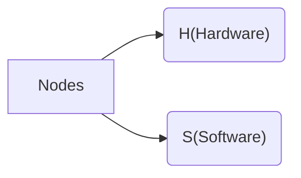

## What is a node?
Nodes is a software or hardware implementation of some instruction(Not functions), which ***used*** by functions to work with hardware of CPU
Nodes are separated for two classed H-node and S-node



### Hardware nodes
Hardware nodes - Nodes right on CPU. The physically soldered on CPU
Hardware nodes used to connect system software with physical hardware

### Software nodes
Software node - node which is not physically represented, but exist on system core. 
Used as core's API to access physical nodes on CPU
>[!NOTE]
>If hardware node has name `h123`, software note will has name `s123`

Node access to H-nodes provided by [ESFS](ESFS.md) API
Software node access provided by [QTK](QTK.md) API


>[!EXAMPLE] Display node usage example
>```mermaid
>graph LR
>
>Program --> QTK(QTK API) --> func("f{QTK.system.node.display}") --> s_node(s007) --> ESFS(ESFS API) --> h_node(h007)
>h_node --> CPU
>```