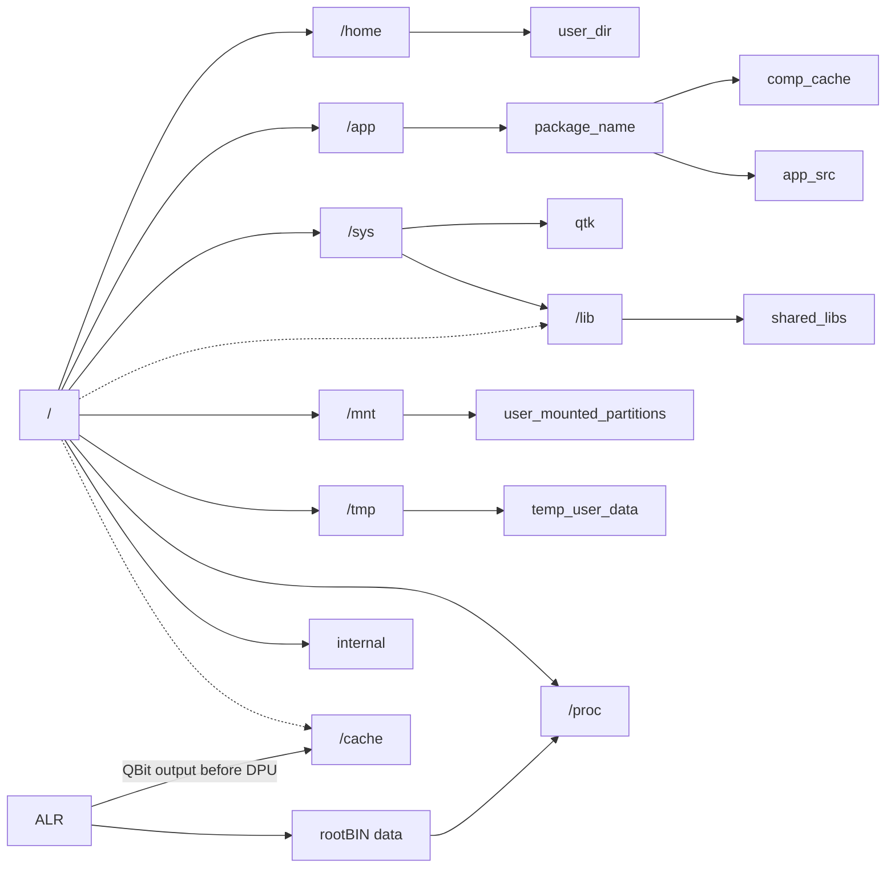

QRoot is quantum [logical partition](Filesystem%20Hierarchy.md) that storage actual system files and data, **not core or kernel**.
User data stored on this partition in `/home/user_name` directory
QRoot is mounted to ==sd/ESFS/[ESFS.Q](ESFS.Q.md)/QFS/QRoot== but actually created at ==sd/ESFS/ESFS.Q==

>[!IMPRT] Important
>If QRoot is failed to load or it's working corrupted, [QOS](QOS⚛️.md) will automatically switched to QOS Rescue Mode by QRootStatusHandler(*core service*)

Here is QRoot's root hierarchy **↓**
### Hierarchy of QRoot partition
