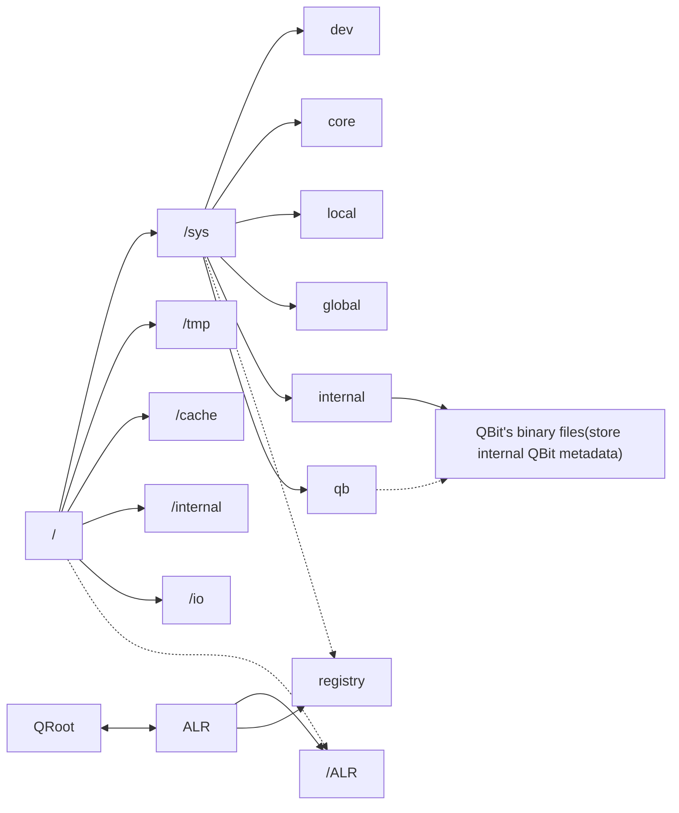
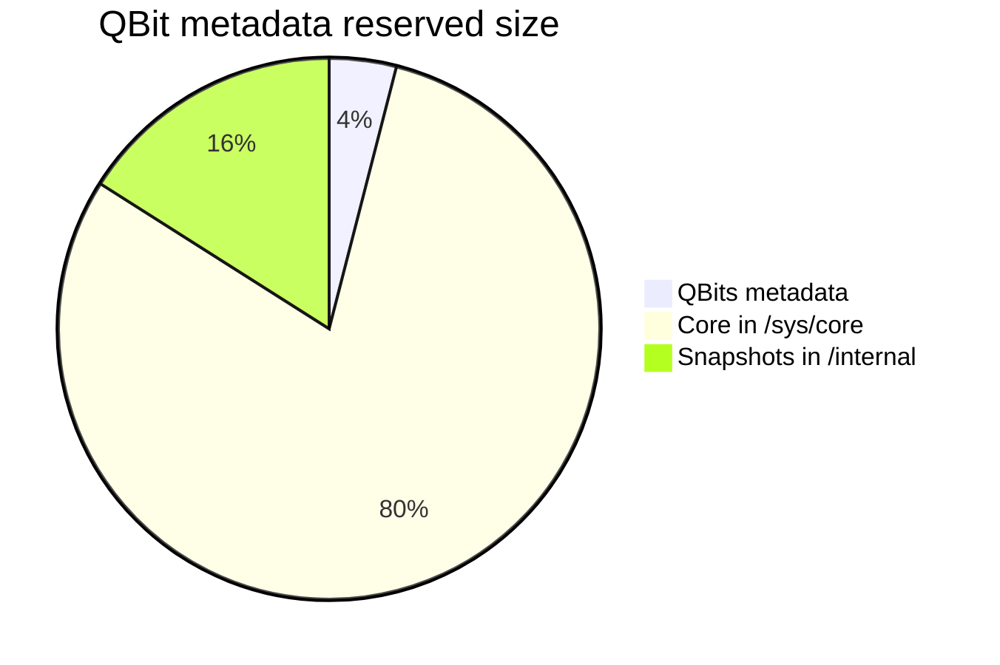

rootBIN is the binary [logical partition](Filesystem%20Hierarchy.md) which stores system's core source. Used as basic partition for system initialization. Mounted to [ESFS](ESFS.md) partition directly

### Hierarchy of rootBIN partition

### rootBIN reserved space
