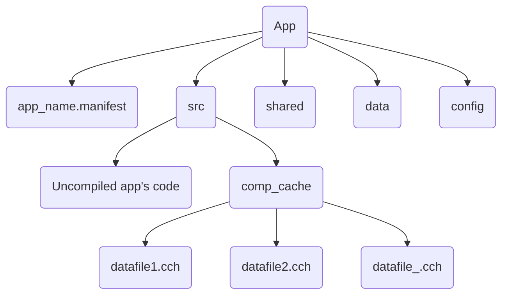

Apps stored in [QRoot](QRoot.md)/app

### App package hierarchy

#### src
All source app's code files and `comp_cache` directory with pre-compiled data chunks(not all code of `app` package is compiled(running under `rawrun`)) 
#### data
User assigned data, like generated images, user's files for app, service files
#### shared
If app using one of `QTK.network.share.*` funcs, this directory will be created automatically. 
Used for storing all shared file of app
#### config
Based on the name, just store app's config files
#### Manifest
Describes package type, version, used [QTK](QTK.md) version, dependencies, installation source, app launcher name, ID, init file, lowest QTK version, lowest [QOS](QOS⚛️.md) version, depending [daemons](Packages.md), [Nodes](Nodes.md), registry rules, e.t.c

>[!IMPRT] Apps of different users
>App are exclusive for every user
>Depend on what user are currently logined in LoginD, apps of that user will be in `app` folder
>Apps in QOS technically stored in `QRoot/internal/apps/`, but at the moment of user logining in with LoginD, [ALR](ALR.md) creates a new virtualFS for apps, defines which of these apps are for LoginD's current user, and adds soft-links to this app's folders to this virtualFS, then mount this virtualFS to QRoot/app