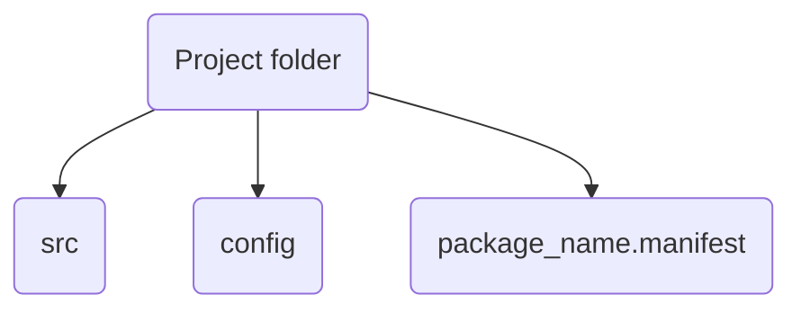

# What is OBJQcomp
OBJQComp is a [QOS](QOS⚛️.md) default compiler, it deeply supported in system, all default apps are compiled using OBJQcomp, system itself compiled with that compiler.

## Installing OBJQcomp for developers
OBJQcomp is installed by default, but not providing any developer compilation libs. So you need to install OBJQcomp-devel version for compiling your code.
>[!REQV]
>```shell
>appx install objqcomp-devel objqcomp-libs
>```
>>[!NOTE]
>>objqcomp-libs is a dependency of objqcomp-devel and it will be installed automatically while installing objqcomp-devel. Specifying as installation candidate not needed
>
## Running OBJQcomp initialization for your project for the first time
First of all, OBJQcomp needs a specific file hierarchy of your project, using another will be prevented by OBJQcomp.


### src
In src you store all source code of your package

### config
Stores configuration of your package

### Manifest
Stores description of all package properties 

### Initialization of OBJQcomp
To init OBJQcomp just write this in terminal in root folder of your project:
>[!REQV] Command
>```shell
>objq compiler init local:/
>```
This command will create `compile.objqcomp` file in project's root directory. This also creates a project derivative, QOS's git replacement.

## Explaining compilation flags
To compile something you need to execute this in terminal:
>[!REQV] Command
>```shell
>objq compiler compile <some flag, some flag, some flag> -compilation-file compile.objqcomp
>```

Most basic flags is package specification flags
>[!EXAMPLE]
>`--compile-as-lib=True` - Compile as library
>`--compile-as-daemon=True` - Compile as daemon
>`--compile-as-node=True` - Compile as Node
>`--compile-as-comp=True` - Compile as component

### All available flags list
>[!INFO]
>`--compile-with-rawrun=True/False` - Determine compilation method, chunky or full
>`--compile-using-external-libs=True/False` - Used if in project used any 3rd party libs.
>`--set-basic-IO-system=QTK/Direct/ESFS/QFS.API` - Used to determine default IO system, default is `QTK` but you can select needed for your purposes
>`--compile-executable-type=.app/.elf/.exec/.exe/nExt` - Sets output executable file format `.exe` is a compatibility format to run in Windows, `.elf` used in Linux, can also launched in QOS. `.exec` is previously-gen  executable file format. `nExt` is just `.app` but without file extension
>`--support-custom-cores=True/False` - Allow app running on custom build cores without spoofing original core signature 
>`--compile-chunks-in-selected-format=True/False` - Used if `comp_cache` not storing in appropriate directory, for example in archive or directory with another name. Needed specified comp_cache file format in `compile.objqcomp` file

## compile.objqcomp
objqcomp files has their own syntax so it explained here
```objqcomp
!# Header;

using objqcomp.ver == LTS
exported filename == export
exported filetype == app/exe/exec/elf/nExt

[Manifest]
data.determine from app.manifest

[Compilation]
qtk.ver == LTS : qos.ver == LTS
imported set locale
[[Vardata]]
	assigned with locale: using locale.objq
libs using sys
assign overrided:L1 with override.cfg

[Chunks] %Used if chunky method selected%
chunky percentage default % default(30)/1-99 %
chunky compile deep set default % sets the deep of intenal interpreting of file%
chunky compile recursive
[[RawRun]]
	export rootBIN/sys/core/default/init/rawrun
	destin -use_prop run_vsys, run_filetype, run_predicted
	import rawrun
	use rawrun

[Depend] % Used only if used 3rd party libs %
depend on libQT : in file as QT
{prjlib:QT-devel ; applib:QT}

#! Header;
```