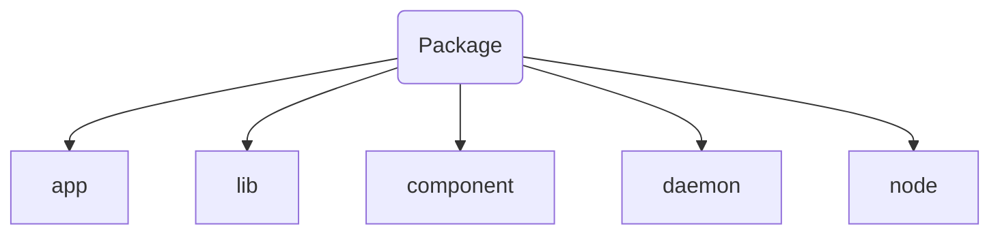

Packages is [QOS](QOS⚛️.md) are separated in several different types


All `app` packages stored at [QRoot](QRoot.md)/app
All `lib` in QRoot/sys/lib(aliased as QRoot/lib)
All `component` at QRoot/sys/comp
All `daemon` in QRoot/sys/daemons
All `node` in [rootBIN](rootBIN.md)/sys/nodes
>[!INFO] Node
>```mermaid
>graph LR
>
>roobin("rootBIN/sys/nodes") --> ALR(ALR) --> qroot("QRoot/proc") --> nodes("QRoot/sys/internal/nodes")
>```

#### [App](Apps.md) packages
App packages - user installed packages for utilitarian tasks
>[!TIP]
>To compile package as `app` you shouldn't point any package type specs in compiler settings

>[!INFO]
>Packages in `app` directory are different for every system's user because `app` is a part of virtual filesystem mounted to QRoot/app. Changing user will cause virtualFS change and packages will change too

#### Lib packages
Lib packages - shared libs, available for every user in the system
Stores a developer kits(as QT-devel) and userspace libs(as QT)
>[!TIP]
>To compile package as `lib` you should specify package type in compiler settings with flag `--compile-as-lib=True`

#### Component packages
Components - used as libs but have a little difference. Components store only functions and cannot store classes
>[!TiP]
>To compile package as component you should specify package type with `--compile-as-comp=True`

#### Daemons
Daemons - system defined always running processes, usually used for monitoring smth or detecting some actions and conditions
>[!TIP]
>To compile package as `daemon` you should specify package type with `--compile-as-daemon=True` and `--set-output-package-internal-name=smthD` and `--set-package-internal-id=smth.04`
>
>Optionally you can specify default profile for daemon with `--set-daemon-default=<01...0100>`

#### [Nodes](Nodes.md)
Node - user-defined S-node for lib or app purposes. Installed in [rootBIN](rootBIN.md) partition so it must to have registry entry specified.
>[!TIP]
>To compile package as `node` you should specify package type with `--compile-as-node=True` and `--use-predefined-registry=path/to/local/.reg/file`