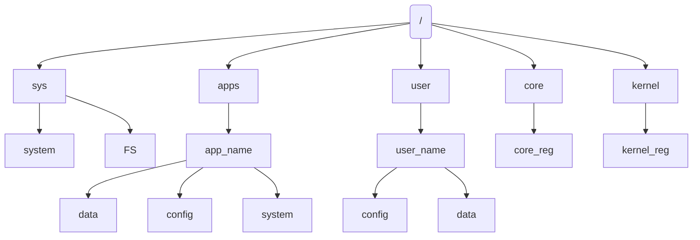

[QOS](QOS⚛️.md) has an internal registry, which is storing apps data, internal system data, user settings, e.t.c. Registry is a copy of local `.conf` files, so you can edit both registry or config file, and the will be synced using `RegSyncHandler`
QOS also has [Bit-Registry](Bit%20Registry.md), but this is in another article.

### Registry structure

